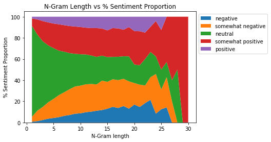

Inferential Statistics
----------------------

The Stanford Sentiment Treebank dataset only provides explanatory
variables in the form of sentiments associated with words and phrases
themselves and the sentence structure that results in the associated
sentiment.

Here we examine the relationship between n-gram length and associated
Sentiments.

N-gram length vs Sentiment Labels Relationship
~~~~~~~~~~~~~~~~~~~~~~~~~~~~~~~~~~~~~~~~~~~~~~

The original paper highlights this correlation, repeated here for
emphasis. The N-grams length is directly related to the height of the
node in the tree and is equal to max(left height, right height) + 1
where height of the leaves is assumed to be 1.

.. code:: ipython3

    # Imports
    import os
    import sys
    import numpy as np
    import matplotlib.pyplot as plt
    import seaborn as sns

.. code:: ipython3

    # Set path to model code
    PROJ_ROOT = os.pardir
    sys.path.append(PROJ_ROOT)
    from src.features.tree import Tree
    from src.models.data_manager import DataManager

.. code:: ipython3

    # Function to get a tuple of (root_ngram, [(ngram, sentiment),...])
    label_size = 5
    def get_ngram_sentiment(node):
        if node.isLeaf:
            return (1, np.asarray([(1, node.label)]))
        else:
            left_h, left_arr = get_ngram_sentiment(node.left)
            right_h, right_arr = get_ngram_sentiment(node.right)
            curr_h = max(left_h, right_h) + 1
            curr_arr = np.concatenate([[(curr_h, node.label)], left_arr, right_arr])
            return (curr_h, curr_arr)

.. code:: ipython3

    # Get parsed trees
    trees_path = '../src/data/interim/trainDevTestTrees_PTB/trees/'
    x_train = DataManager(trees_path).x_train

.. code:: ipython3

    from collections import Counter, defaultdict
    max_x = 0
    ngrams = defaultdict(list)
    for i in range(len(x_train)):
        h, arr = get_ngram_sentiment(x_train[i].root)
        max_x = max(max_x, h)
        for k, v in arr:
            ngrams[k].append(v)
    
    ngram_counts = defaultdict(Counter)
    for k, v in ngrams.items():
        ngram_counts[k] = Counter(v)
    
    # Data
    x = range(1, max_x+1)
    y = list()
    for i in range(max_x):
        a = np.zeros(label_size)
        for j in range(label_size):
            a[j] = ngram_counts[i+1][j]
        y.append(a * 100 / sum(a))

.. code:: ipython3

    # Plot
    _ = plt.stackplot(x, np.transpose(y), labels=['negative', 'somewhat negative', 'neutral', 'somewhat positive', 'positive'])
    _ = plt.legend(bbox_to_anchor=(1, 1), loc='upper left', ncol=1)
    _ = plt.xlabel('N-Gram length')
    _ = plt.ylabel('% Sentiment Proportion')
    _ = plt.title('N-Gram Length vs % Sentiment Proportion')
    plt.show()

The graph reproduced from the original paper shows that the shorter
phrases have mostly neutral sentiment and the longer the phrase, the
more likely the sentence will have a positive or a negative sentence
associated with it.
