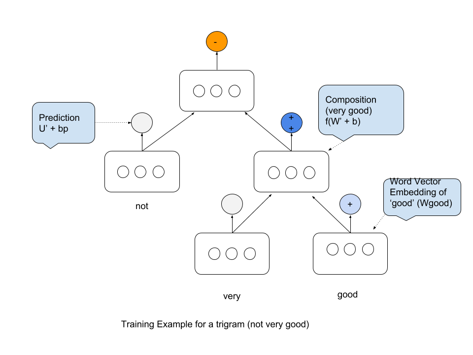

Model Description
~~~~~~~~~~~~~~~~~

During the data exploration phase, we observed that longer n-gram length
is associated with a presence of a sentiment. However, bag of words kind
of models fail to capture compositional effects associated with sentence
structure such as sentence negation. The Recursive Neural Tensor Network
Model (RNTN) is a recursive neural network model that captures these
compositional effects by relying on constituency parsed representation
of the trees.

The model computes word vector representations for each word in the
vocabulary and generates similar word representations for intermediate
nodes that are recursively used for predictions for the root node.

The following trigram example shows how the prediction occurs at each
phase.

   Trigram Example

Each word vector is represented as a :math:`d` dimensional word vector.
All the word vectors are stacked in the word embedding matrix :math:`L`
of dimensions [d, V], where V is the size of the vocabulary. The word
vectors are initialized from a random uniform distribution in interval
[-0.0001, 0.0001], and the L matrix is seen as a parameter that is
trained jointly with the compositionality models.

A word vector for every intermediate node in the tree, that is not a
leaf, is a bi-gram and is computed recursively from its children.

The Composition step can be represented by the following equations:

   :math:`zs = W*X + b` (Standard term)

..

   :math:`zt = X^{T} * T * X` (Neural Tensor term)

   :math:`a = f(zs + zt)` (Composition function)

where:

W: Weights to be computed by the model of shape [:math:`d`, 2\ :math:`d`] for Composition step.

X: Word embeddings for input words stacked together. X is a column vector of shape [2*:math:`d`, 1]

b: bias term for the node of shape [:math:`d`, 1]

T: Tensor of dimension [2*:math:`d`, 2*\ :math:`d`, :math:`d`]. Each T[:,:,\ :math:`i`] slice
generates a scalar, which is one component of the final word vector of
dimension d.

f: Non-linear function specifying the compositionality of the classifier. *tanh* in this case.

The main benefit of this model is due to the tensor layer. This layer
generates internal representations for the most common tree structures,
and removes the need to maintain contextual representations for
intermediate nodes.

The generated word vectors are used as parameters to optimize and as
feature inputs to a softmax classifier to project weights to sentiment
probabilities. For classification into five classes, we compute the
posterior probability over labels given the word vector via:

   y = :math:`U^{T} * a + bs`

where,

U: Sentiment Classification Matrix Weights to be computed by
model for Projection Step of shape [d, label_size] where label_size is
the number of classes.

bs: Bias term for Projection Step of shape
[label_size, 1] \* a: Output of the composition layer

For the above example, let

   :math:`b` = Word vector embedding of ‘very’

..

   :math:`c` = Word vector embedding of ‘good’

   :math:`p1` = Composed Word vector for phrase ‘very good’

The vector is composed as:

   :math:`p1 = f\left( \left[ \begin{matrix} b \\ c \end{matrix} \right]^{T} T^{[1:d]} \left[ \begin{matrix} b \\ c \end{matrix} \right] + W \left[ \begin{matrix} b \\ c \end{matrix} \right] \right)`

Similarly, the final sentiment of the phrase ‘not very good’ is computed
recursively using word embedding for ‘not’ and :math:`p1`. Let,

   :math:`a` = Word vector embedding of ‘not’

..

   :math:`p2` = Composed Word vector for phrase ‘not very good’

   :math:`p2 = f\left( \left[ \begin{matrix} a \\ p1 \end{matrix} \right]^{T} T^{[1:d]} \left[ \begin{matrix} a \\ p1 \end{matrix} \right] + W \left[ \begin{matrix} a \\ p1 \end{matrix} \right] \right)`

Loss
^^^^

The goal of the optimizer is to maximize the prediction or minimize the
cross-entropy error between the predicted distribution :math:`y_{i}` and
the target distribution :math:`t_{i}`. This is equivalent (up to a
constant) to minimizing the KL-divergence between the two distributions.
The error (:math:`E`) as a function of the RNTN parameters,

   :math:`\theta = (L, W, U, T)`

..

   :math:`E(\theta) = \sum_{i} \sum_{j} t_{j}^{i} \log y_{j}^{i} + \lambda||\theta||^{2}`

where

   :math:`i` = index of every node in the tree.

..

   :math:`j` = index of every class in the label.

We use L2 regularizer here as it is more computationally efficient and
we do not need feature selection.

The optimization is done using AdaGrad optimizer as it adapts the
learning rate to the parameters, performing smaller updates (i.e. low
learning rates) for parameters associated with frequently occurring
features, and larger updates (i.e. high learning rates) for parameters
associated with infrequent features.

Back-progagation
^^^^^^^^^^^^^^^^

For understanding back-propagation, we start by looking at the
derivative of the loss function at Projection and Composition steps for
all nodes with respect to parameters :math:`(U, W, T)`.

The derivative of the loss function at with respect to :math:`U` is the
softmax cross-entropy error, which is simple the sum of each node error,
that is,

   :math:`\delta_{i, s} = U^{T}(y_i - t_i) \otimes f’(x_i)`

where,

:math:`\delta_{i, s}` is the softmax error at Projection Layer.

:math:`y_i` is the ground truth label.

:math:`t_i` is the predicted softmax probability.

:math:`x_i` is the vector from the Composition layer.

:math:`f'` is the derivative of tanh and is given by
:math:`f'(x) = 1 - f(x)^2`.

:math:`\otimes` indicates a *Hadamard* product.

Next we look at how error changes with respect to Composition Layer
weights :math:`W` and :math:`T`.

The error due to Composition Layer changes depending on which node we
are looking at. For the root node, this value is the softmax error from
the Projection Layer. For other nodes, this error can only be computed
in a top-down fashion from root node to the leaves.

Let :math:`\delta_{i, com}` be the incoming error vector at node
:math:`i`. For the root node :math:`\delta_{p2, com} = \delta_{p2, s}`.
This can be used to compute the standard derivative with respect to
:math:`W` as :math:`W^{T}\delta_{p2, com}`.

Similarly, the derivative with respect to T can be obtained by looking
at each tensor slice for :math:`k=1,...,d` as, >
:math:`\frac{\partial E^{p2}}{\partial V^{[k]}} = \delta_{p2, com} \left[ \begin{matrix} a \\ p1 \end{matrix} \right] \left[ \begin{matrix} a \\ p1 \end{matrix} \right]^{T}`

The total derivative for the error with respect to :math:`W` and
:math:`T` at node :math:`p2` becomes, >
:math:`\delta_{p2, out} = \left( W^{T} \delta_{p2, com} + S \right) \otimes f' \left( \left[ \begin{matrix} a \\ p1 \end{matrix} \right] \right)`

where,

   :math:`S = \sum_{k=1}^{d} \delta_{p2, com}^k \big( V^{[k]} + (V^{[k]})^T \big) \left[ \begin{matrix} a \\ p1 \end{matrix} \right]`

The children of p2, will then each take half of this vector and add
their own softmax error message for the complete :math:`\delta`. In
particular, we have for :math:`p1`,

   :math:`\delta_{p1, com} = \delta(p1, s) + \delta_{p2, out}\big[ d+1:2d \big]`,

where,

   :math:`[d+1:2d]` represents the vector corresponding to the right
   child.

The full derivative is the sum of derivatives at all nodes, or

   :math:`\frac{\partial E}{\partial V^[k]} = \sum_{i} \sum_{k=1}{d} \delta_{i, com}^k`.

The derivative of W can be computed in exactly similar way.
