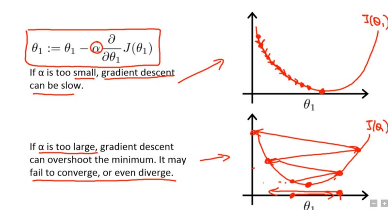
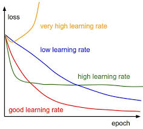
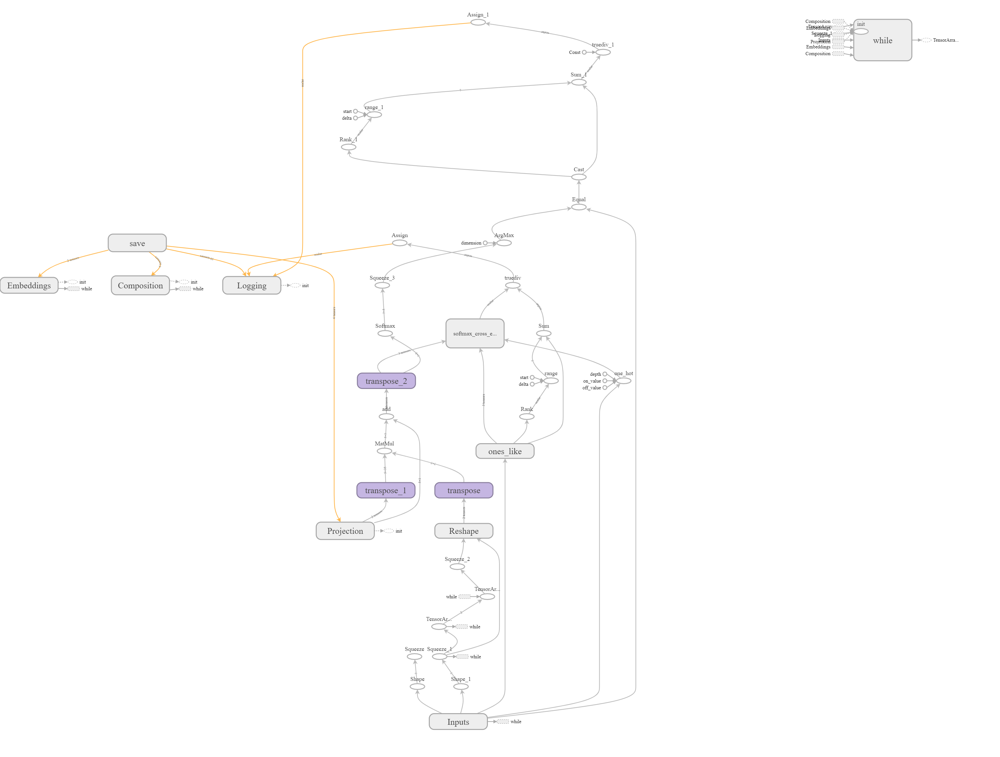
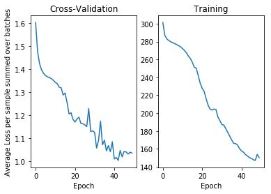
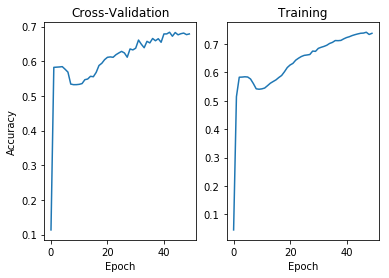

Model Training
~~~~~~~~~~~~~~

We look at how the RNTN model is trained and some metrics such as cross
entropy loss and accuracy change as the model is trained. The model is
trained for a fixed number of epochs with an adaptive learning rate and
early stop on decrease in cross-validation loss.

Training Parameters
^^^^^^^^^^^^^^^^^^^

Number of epochs
''''''''''''''''

The number of epochs is determined empirically by observing when
overfitting occurs or when the network stops learning. Overfitting is
determined by when cross-validation loss increases even if training loss
increases.

For this network, the number of epochs was around 50 training passes
over the dataset.

Batch Size
''''''''''

Batch size again was determined empirically to be between 20 and 30
training samples. Bigger training batches caused reduction in
performance. The Adagrad optimizer runs after every batch to update
weights using back propagation.

There is a smaller imbalance in training samples at root sentiment
level, in comparison to the leaf level. A balanced batch of equal class
distribution is generated using imblearn’s balanced batch generator,
which uses random undersampling by default.

Learning Rate
'''''''''''''

Learning Rate is again determined empirically. The loss function gives
out NaN’s for any values above 0.1 or 0.0001 training rates due to
exploding and vanishing gradients respectively.

   title

Image credit: Andrew Ng’s Coursera course on ML

   title

Image Credit: cs231n

The initial learning rate is determined to be 0.01 and then it is
adaptively changed based on following algorithm: \* If the
cross-validation loss is less than itself from previous epoch, the
learning rate is decreased \* If the cross-validation loss is less than
threshold of 1% from previous epoch, the learning rate is increased.

For this network, learning rate of 0.01 gives the minimum amount of
epochs needed for convergence.

Regularization
^^^^^^^^^^^^^^

Regularization is needed for all model variables to prevent word
embeddings and weights from increasing wildly. We use :math:`L2` loss
which guarantees convergence to a unique stable solution, although it is
not robust. The Regularization co-efficient is empirically determined to
be 0.001, which is usually between 1% to 20% of the cross entropy loss.

Fixing Class Imbalance
^^^^^^^^^^^^^^^^^^^^^^

As we noticed in the earlier section, there is a huge imbalance at the
leaves, with most of the words being marked neutral. To get around this
oversampling was used for each tree to prevent the weights from learning
only the majority class.

We do not use undersampling at the tree level of processing as there is
a huge information loss when the nodes are not used. The word vectors
are already sparse and not using leaves does not train vocabulary
enough.

Oversampling leads to over-fitting, which manifests as negative words
having more weights, or neural network having a more extreme view of
both positives or negatives if leaf distribution proportion is used as
weights.

A good balance is random oversampling of leaves instead of using
weights. This leads to highest root sentiment accuracy seen so far,
although the network mis-classifies extreme values as slightly extreme
values.

Other methods such as Tomek-Link or SMOTE could give even better
performance than just random oversampling, but they were not tried as
these neighbour based methods require a well-defined metric to compare
if the samples are near. Such a distance metric could be PARSEVAL metric
for comparing parsed trees, but that adds significant complexity in
model evaluation.

Loss Function
^^^^^^^^^^^^^

The loss function is chosen so as to maximize the probability of the
sentiment label, which is the same as minimizing the KL Divergence of
the labels. This minimal value is achieved using cross entropy loss over
softmax distribution of the output of the neural network called logits
in Tensorflow documentation.

   Softmax Probabilities are computed as:
   :math:`s(x) = \frac{e^{ax}}{\sum_{j} e^{ax}}` where :math:`j` are the
   classes in the sentiment.

Another loss function tried was the max margin loss function, this
function is computed as: > Max Margin Loss
:math:`m(x) = max(0, 1 - s_{pos} + s_{neg})` where,

:math:`s_{pos}` is the probability of the positive score.
:math:`s_{neg}` is the sum of probabilities of the negative scores,
which are just randomly picked sentiment label.

The max-margin loss function is commonly used in SVM to maximize the
distance between the training samples on the boundary of classification.
In this case, the loss function did not give any better performance than
the Cross-Entropy loss.

Tensorflow Graph
^^^^^^^^^^^^^^^^

The generated tensorflow graph is shown below. It shows the sequence of
computations from placeholders all the way to the final cross-entropy
loss that is computed.

The save part of the graph is used to save the model variables for
non-tensorflow use. The two transpose functions represent the two main
tensor products for the composition function. The loss node is
represented by the softmax_cross_entropy_loss function. The following
image was generated using Tensorboard.

   title

Evaluation Metrics
^^^^^^^^^^^^^^^^^^

The graphs below show how training/cross-validation loss was measured
for various epochs.

.. code:: ipython3

    import matplotlib.pyplot as plt
    import pandas as pd
    dt_cv_loss = pd.read_csv('../src/data/processed/run_RNTN_30_tanh_35_5_None_50_0.001_0.01_8544_training-tag-Logging_Variables_dev_epoch_loss.csv')
    dt_train_loss = pd.read_csv('../src/data/processed/run_RNTN_30_tanh_35_5_None_50_0.001_0.01_8544_training-tag-Logging_Variables_train_epoch_loss.csv')
    dt_cv_accuracy = pd.read_csv('../src/data/processed/run_RNTN_30_tanh_35_5_None_50_0.001_0.01_8544_training-tag-Logging_Variables_dev_epoch_accuracy.csv')
    dt_train_accuracy = pd.read_csv('../src/data/processed/run_RNTN_30_tanh_35_5_None_50_0.001_0.01_8544_training-tag-Logging_Variables_train_epoch_accuracy.csv')

.. code:: ipython3

    # Display Loss Graphs
    plt.subplot(121)
    plt.plot(dt_cv_loss[['Step']], dt_cv_loss[['Value']])
    plt.title('Cross-Validation')
    plt.xlabel('Epoch')
    plt.ylabel('Average Loss per sample summed over batches')
    plt.subplot(122)
    plt.plot(dt_train_loss[['Step']], dt_train_loss[['Value']])
    plt.title('Training')
    plt.xlabel('Epoch')
    plt.show()

The spikes in the cross-validation loss graph correspond to the times
when the learning rate was steadily decreased to find the local minimum.

.. code:: ipython3

    # Display Accuracy Graphs
    plt.subplot(121)
    plt.plot(dt_cv_accuracy[['Step']], dt_cv_accuracy[['Value']])
    plt.title('Cross-Validation')
    plt.xlabel('Epoch')
    plt.ylabel('Accuracy')
    plt.subplot(122)
    plt.plot(dt_train_accuracy[['Step']], dt_train_accuracy[['Value']])
    plt.title('Training')
    plt.xlabel('Epoch')
    plt.show()

The accuracy steadily increases with each epoch until it plateaus at
about 75% for training and 67% for cross-validation set.
