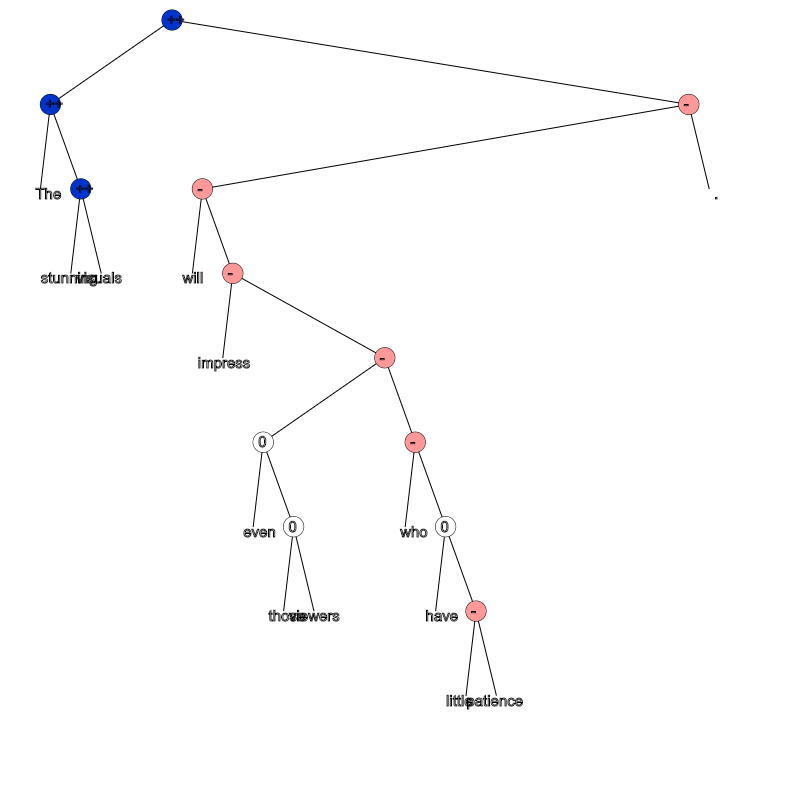
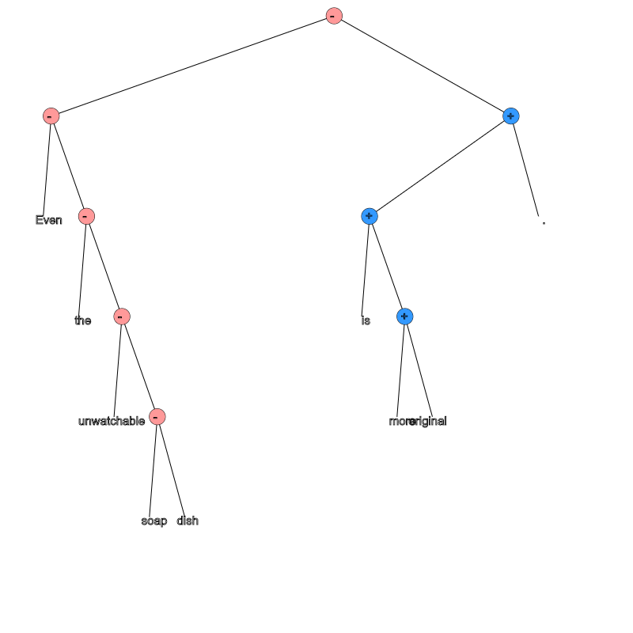
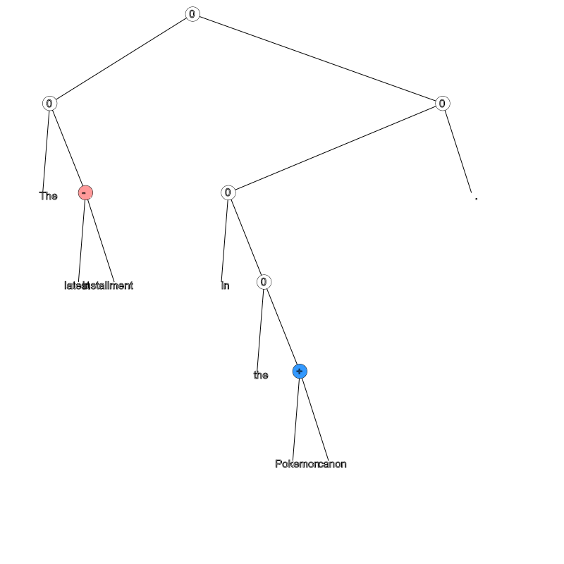
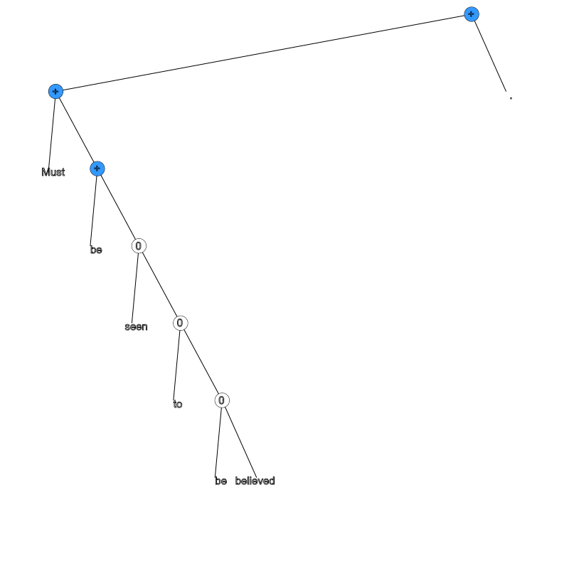
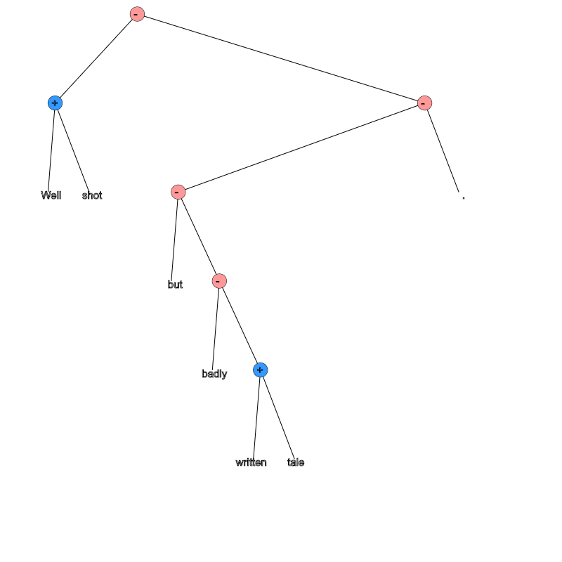
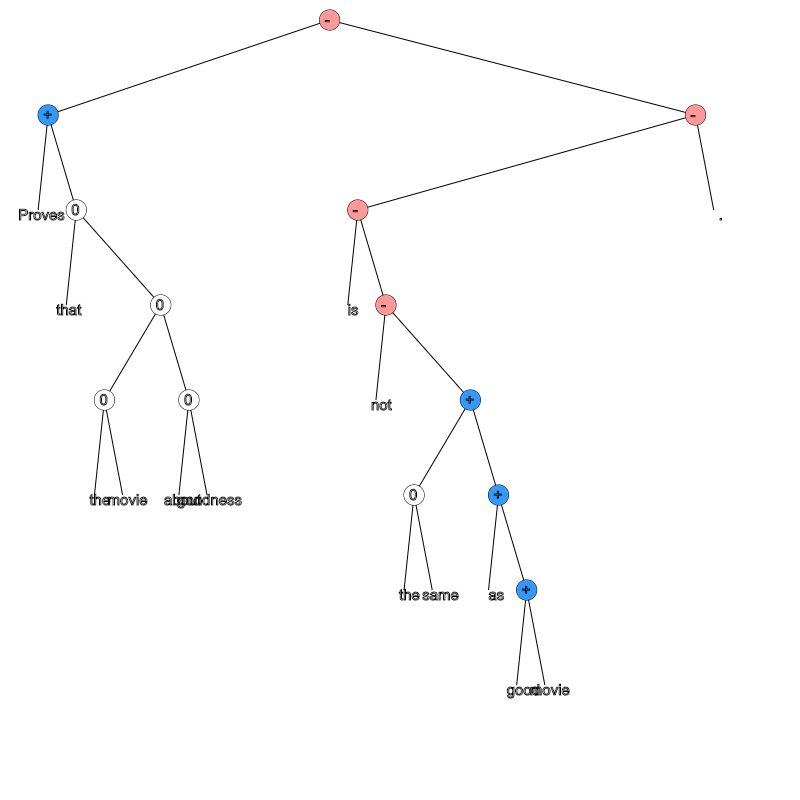
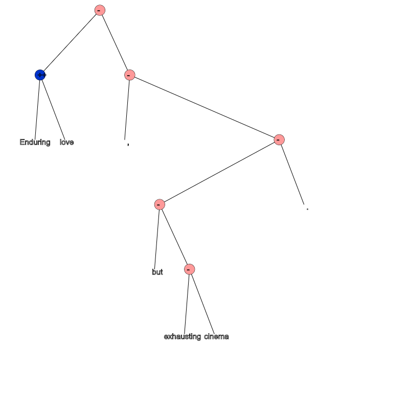
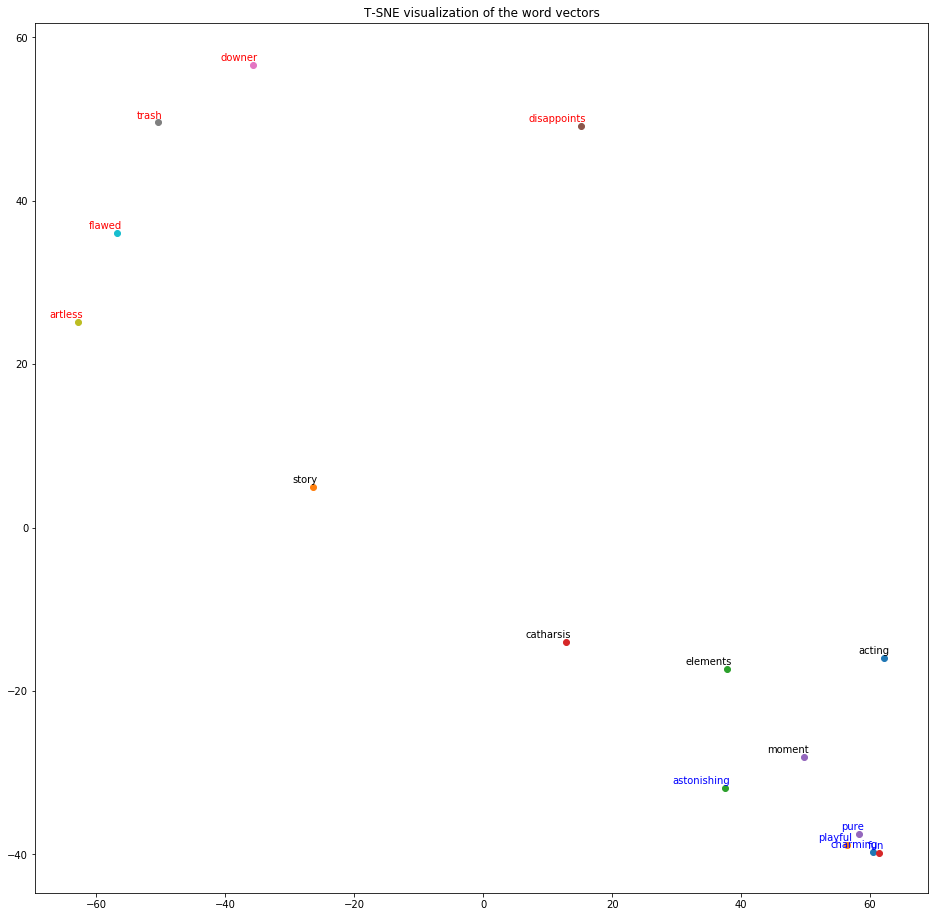

Model Visualization
~~~~~~~~~~~~~~~~~~~

.. code:: ipython3

    # Imports
    import os
    import sys
    import numpy as np
    import matplotlib.pyplot as plt
    import seaborn as sns
    from sklearn.manifold import TSNE
    from IPython.core.display import display, HTML, Image
    
    # Set project root
    PROJ_ROOT = os.pardir
    sys.path.append(PROJ_ROOT)
    from src.features.tree import Tree
    from src.models.data_manager import DataManager
    from src.models.rntn import RNTN
    from src.models.predict_model import predict_model

We look at some of the reviews from the test set, to examine how the
trained model makes predictions.

Example: Positive Sentiment
^^^^^^^^^^^^^^^^^^^^^^^^^^^

This is an example, where the positive sentiment from the left subtree
dominates the right subtree sentiment.

.. code:: ipython3

    def build_str(txt):
        return     \
            '<html><body><h3>Sentiment tree:</h3> \
            <canvas id="treeCanvas" width="800" height="800" style="border:1px solid #000000;"></canvas> \
             \
            </body></html>'

.. code:: ipython3

    pos_txt = 'The stunning visuals will impress even those viewers who have little patience.'
    #y, predict_txt = predict_model(pos_txt)
    #pos_display_txt = build_str(str(predict_txt))
    # display(HTML(pos_display_txt))
    display(Image(filename='../docs/pos_sent_Visualizations.png'))

As seen with this example, the statement is overall very positive even
though a part of the sentence is negative.

Example: Negative Sentiment
^^^^^^^^^^^^^^^^^^^^^^^^^^^

A great example, where the partial phrase expresses positive sentiment
(more original), but the sentence is correctly classified as negative.

.. code:: ipython3

    pos_txt = "Even the unwatchable soap dish is more original."
    # y, predict_txt = predict_model(pos_txt)
    # pos_display_txt = build_str(str(predict_txt))
    # display(HTML(pos_display_txt))
    display(Image(filename='../docs/neg_sen_Visualizations.png'))

Example: Neutral Sentiment
^^^^^^^^^^^^^^^^^^^^^^^^^^

This sentence expresses no opinion and is correctly classified as
neutral.

.. code:: ipython3

    pos_txt = 'The latest installment in the Pokemon canon.'
    # y, predict_txt = predict_model(pos_txt)
    # pos_display_txt = build_str(str(predict_txt))
    # display(HTML(pos_display_txt))
    display(Image(filename='../docs/neutral_sen_Visualizations.png'))

Example: No Sentiment Words
^^^^^^^^^^^^^^^^^^^^^^^^^^^

This is a great example of sentiment prediction, even when there are no
sentiment words!

.. code:: ipython3

    pos_txt = 'Must be seen to be believed.'
    # y, predict_txt = predict_model(pos_txt)
    # pos_display_txt = build_str(str(predict_txt))
    # display(HTML(pos_display_txt))
    display(Image(filename='../docs/no_sen_Visualizations.png'))

Example: Mixed Sentiments
^^^^^^^^^^^^^^^^^^^^^^^^^

This example shows how mixed sentiments are expressed in a parse tree,
the left subtree is slightly positive, while the right subtree changes
the its sentiment due to strong effect of ‘badly’.

.. code:: ipython3

    pos_txt = "Well shot but badly written tale."
    # y, predict_txt = predict_model(pos_txt)
    # pos_display_txt = build_str(str(predict_txt))
    # display(HTML(pos_display_txt))
    display(Image(filename='../docs/mixed_sen_Visualizations.png'))

Example: Sentence Negation
^^^^^^^^^^^^^^^^^^^^^^^^^^

This example shows strong effect of the word ‘not’ in flipping the
sentiment.

.. code:: ipython3

    pos_txt = "Proves that the movie about goodness is not the same as good movie."
    # y, predict_txt = predict_model(pos_txt)
    # pos_display_txt = build_str(str(predict_txt))
    # display(HTML(pos_display_txt))
    display(Image(filename='../docs/sen_neg_Visualizations.png'))

Sentence Orientation flip
^^^^^^^^^^^^^^^^^^^^^^^^^

Here, we see strong effect of the word ‘but’ in flipping the overall
sentiment.

.. code:: ipython3

    pos_txt = "Enduring love, but exhausting cinema."
    # y, predict_txt = predict_model(pos_txt)
    # pos_display_txt = build_str(str(predict_txt))
    # display(HTML(pos_display_txt))
    display(Image(filename='../docs/sen_flip_Visualizations.png'))

Similar Words: t-SNE Visualization
^^^^^^^^^^^^^^^^^^^^^^^^^^^^^^^^^^

One way of validating the generated word vectors is to look at how close
they are to each other. Since the word-embeddings in the trained model
live in high-dimensional space, these have to be mapped to 2-D space for
visualization. t-SNE (t-Stochastic Neighbor Embedding) allows for
reducing the vector to 2-D space.

We look at a few randomly chosen words from each class and see how close
these are in 2-D space.

.. code:: ipython3

    # Load word embeddings from the model
    model_name = 'RNTN_30_tanh_35_5_None_50_0.001_0.01_9645'
    
    # Load model
    rntn_model = RNTN(model_name=model_name)
    L, vocab = rntn_model.get_word_embeddings()

.. code:: ipython3

    # Choose words from each class
    pos_words = ['charming', 'playful', 'astonishing', 'fun', 'pure']
    neg_words = ['disappoints', 'downer', 'trash', 'artless', 'flawed']
    neutral_words = ['acting', 'story', 'elements', 'catharsis', 'moment']
    
    pos_idx = [vocab[i] for i in pos_words]
    neg_idx = [vocab[i] for i in neg_words]
    neutral_idx = [vocab[i] for i in neutral_words]

.. code:: ipython3

    # Generate 2-d word embeddings
    tsne_model = TSNE()
    tsne_embeddings = tsne_model.fit_transform(np.transpose(L))
    x = tsne_embeddings[:, 0]
    y = tsne_embeddings[:, 1]

.. code:: ipython3

    # Show the embeddings
    plt.figure(figsize=(16, 16)) 
    for i in range(5):
        idx = pos_idx[i]
        plt.scatter(x[idx],y[idx])
        plt.annotate(pos_words[i],
                     xy=(x[idx], y[idx]),
                     xytext=(5, 2),
                     textcoords='offset points',
                     ha='right',
                     va='bottom', color='blue', label='positive')
    
    for i in range(5):
        idx = neg_idx[i]
        plt.scatter(x[idx],y[idx])
        plt.annotate(neg_words[i],
                     xy=(x[idx], y[idx]),
                     xytext=(5, 2),
                     textcoords='offset points',
                     ha='right',
                     va='bottom', color='red', label='negative')
    
    for i in range(5):
        idx = neutral_idx[i]
        plt.scatter(x[idx],y[idx])
        plt.annotate(neutral_words[i],
                     xy=(x[idx], y[idx]),
                     xytext=(5, 2),
                     textcoords='offset points',
                     ha='right',
                     va='bottom', label='neutral')
    
    plt.title('T-SNE visualization of the word vectors')
    plt.show()

We see three distinct clusters, one for each of the three groups. The
blue cluster represents the positive words, the red cluster the negative
words and the black cluster represents neutral sentiment.
