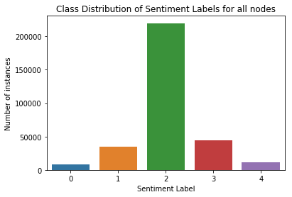
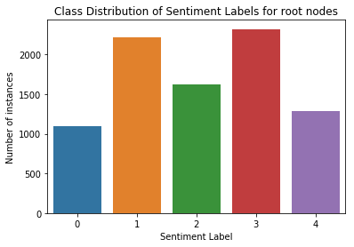

Data Insights on Stanford Sentiment Treebank
--------------------------------------------

The Stanford Sentiment Treebank Dataset contains fully labeled parse
trees giving us sentiment for each word and well as phrases that can be
obtained by performing constituency parsing of the trees.

One of the first goals is to examine how each class labels are
distributed throughout the training data set.

Class label distribution in training data.
~~~~~~~~~~~~~~~~~~~~~~~~~~~~~~~~~~~~~~~~~~

One of the main goals of the experiment is to model the dataset based on

.. code:: ipython3

    # Imports
    import os
    import sys
    import numpy as np
    import matplotlib.pyplot as plt
    import seaborn as sns

.. code:: ipython3

    # Set path for models
    PROJ_ROOT = os.pardir
    sys.path.append(PROJ_ROOT)
    from src.features.tree import Tree
    from src.models.data_manager import DataManager

.. code:: ipython3

    # Function to get class distribution in a node
    label_size = 5
    def get_num_labels(node):
        """Function to get number of labels of each type under a given tree structure."""
        r = np.zeros(label_size)
        r[node.label] = 1
        if node.isLeaf:
            return r
        else:
            return get_num_labels(node.left) + get_num_labels(node.right) + r
    
    # Get parsed trees
    trees_path = '../src/data/interim/trainDevTestTrees_PTB/trees/'
    x_train = DataManager(trees_path).x_train
    
    y = np.zeros(label_size)
    for i in range(len(x_train)):
        y += get_num_labels(x_train[i].root)
    
    print('Class Distribution of Sentiment Labels: {0}'.format(y))

.. parsed-literal::

    Class Distribution of Sentiment Labels: [  8245.  34362. 219788.  44194.  11993.]
    

.. code:: ipython3

    # Plot the distribution
    _ = sns.barplot(list(range(5)), y)
    _ = plt.xlabel('Sentiment Label')
    _ = plt.ylabel('Number of instances')
    _ = plt.title('Class Distribution of Sentiment Labels for all nodes')

The class distribution is very heavily skewed towards neutral values.
This class imbalance will influence the training of neural network and
needs to be handled.

.. code:: ipython3

    y_root = np.zeros(label_size)
    for i in range(len(x_train)):
        r = np.zeros(label_size)
        r[x_train[i].root.label] = 1
        y_root += r
    
    print('Class Distribution of Root Sentiment Labels: {0}'.format(y_root))

.. parsed-literal::

    Class Distribution of Root Sentiment Labels: [1092. 2218. 1624. 2322. 1288.]
    

.. code:: ipython3

    # Plot the distribution of nodes for root nodes
    _ = sns.barplot(list(range(5)), y_root)
    _ = plt.xlabel('Sentiment Label')
    _ = plt.ylabel('Number of instances')
    _ = plt.title('Class Distribution of Sentiment Labels for root nodes')

The nodes for root sentiment labels are more evenly distributed, and the
minor class imbalance will again be corrected for training.

.. code:: ipython3

    ### Top Positive and Negative words
    
    from collections import defaultdict, Counter
    
    vocab = defaultdict(list)
    for i in range(len(x_train)):
        tree = x_train[i]
        stack = [tree.root]
        while stack:
            node = stack.pop()
            if node.isLeaf:
                vocab[node.word].append(node.label)
            else:
                stack.append(node.right)
                stack.append(node.left)
    
    vocab_mean = defaultdict(float)
    for k,v in vocab.items():
        vocab_mean[k] = np.mean(v)

.. code:: ipython3

    positive_words = [x[0] for x in Counter(vocab_mean).most_common(50)]
    print('Most positive words: ' + ','.join(positive_words))

.. parsed-literal::

    Most positive words: charming,playful,astonishing,ingeniously,fun,pure,excellent,award-winning,terrific,Freedom,love,Great,creative,humor,great,beautiful,pleasure,better,sweet,perfect,smart,best,happy,funniest,glorious,delightful,honest,joy,masterpiece,fresh,slam-dunk,encourage,entertaining,impressive,brilliantly,shines,powerful,thoughtful,Oscar-worthy,nicest,pretty,remarkable,laughing,marvelous,worthy,laughter,enthralling,captivating,goodies,Oscar-sweeping
    

.. code:: ipython3

    negative_words = [i[0] for i in sorted(vocab.items(), key=lambda x: x[1])]
    print('Most negative words: ' + ','.join(negative_words[:20]))

.. parsed-literal::

    Most negative words: Goddammit,Flawed,artless,bitchy,bruised,negativity,inferior,disinterest,disappoints,cringe,downer,grotesquely,horrendously,Snide,cold-fish,dehumanizing,pissed,trash-cinema,car-wreck,stalking
    

The sentiments for both kinds of words match expectations. One of the
cross-checks would be to validate the generated word-embeddings against
these sentiment values.
