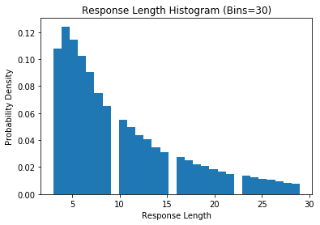

Data Insights
~~~~~~~~~~~~~

Load the already cleaned question answer pairs generated.

.. code:: ipython3

    # Python Imports
    import numpy as np
    import pandas as pd
    import matplotlib.pyplot as plt
    import seaborn as sns

.. code:: ipython3

    # Load the QA dataset
    qa = pd.read_csv('../src/data/processed/movie_qa.txt', index_col=0)
    qa.head()

.. raw:: html

    

    
    <table border="1" class="dataframe">
      <thead>
        <tr style="text-align: right;">
          <th></th>
          <th>question</th>
          <th>answer</th>
        </tr>
      </thead>
      <tbody>
        <tr>
          <th>0</th>
          <td>Can we make this quick  Roxanne Korrine and An...</td>
          <td>Well I thought we would start with pronunciati...</td>
        </tr>
        <tr>
          <th>1</th>
          <td>Well I thought we would start with pronunciati...</td>
          <td>Not the hacking and gagging and spitting part ...</td>
        </tr>
        <tr>
          <th>2</th>
          <td>Not the hacking and gagging and spitting part ...</td>
          <td>Okay then how about we try out some French cui...</td>
        </tr>
        <tr>
          <th>3</th>
          <td>Okay then how about we try out some French cui...</td>
          <td>&lt;EOC&gt;</td>
        </tr>
        <tr>
          <th>4</th>
          <td>you are asking me out  that is so cute what is...</td>
          <td>Forget it</td>
        </tr>
      </tbody>
    </table>
    

Response Length
^^^^^^^^^^^^^^^

We first look at the how long a typical response is. We start by
filtering out End of conversation markers ‘EOC’

.. code:: ipython3

    # Filter out EOC
    qa_no_eoc = qa[qa.answer != '<EOC>']['answer']
    
    # Get lengths for each value
    resp_len = qa_no_eoc.apply(lambda x: len(str(x).split()))
    
    resp_len.describe()

.. parsed-literal::

    count    221616.000000
    mean         11.083054
    std          12.630780
    min           0.000000
    25%           4.000000
    50%           7.000000
    75%          14.000000
    max         556.000000
    Name: answer, dtype: float64

We see that the median response length is 7 words, but the distribution
is skewed by presence of extreme outliers. Lets look at the box plot for
verification.

.. code:: ipython3

    # Box Plot
    _ = sns.boxplot(resp_len, orient='v')
    _ = plt.ylabel('Response Length')
    _ = plt.xlabel('')
    _ = plt.title('Box Plot Response Length')

We remove the outliers by using the 1.5 times IQR thumb rule, so we
filter out values outside range (2, 30)

.. code:: ipython3

    filt = np.logical_and(resp_len > 2, resp_len < 30)
    resp_len_filt = resp_len[filt]
    
    resp_len_filt.describe()

.. parsed-literal::

    count    173926.000000
    mean          9.990921
    std           6.379758
    min           3.000000
    25%           5.000000
    50%           8.000000
    75%          13.000000
    max          29.000000
    Name: answer, dtype: float64

.. code:: ipython3

    _ = plt.hist(resp_len_filt, density=True, bins=30)
    _ = plt.xlabel('Response Length')
    _ = plt.ylabel('Probability Density')
    _ = plt.title('Response Length Histogram (Bins=30)')

We see that response length goes down exponentially. People prefer
brevity in responses over longer sentences. This is an important insight
for training batches, as the longer input sequences lead to padding in
shorter sequences increasing cpu/memory usage.

Conversation Length
^^^^^^^^^^^^^^^^^^^

Next we look at how long do conversations last. This can be easily
inferred by looking at the eoc_markers.

.. code:: ipython3

    eoc_marks = sorted(list(set(qa.answer.index.values) - set(qa_no_eoc.index.values)))
    
    conv_len_arr = [eoc_marks[0]]
    for i in range(len(eoc_marks)-1):
        conv_len_arr.append(eoc_marks[i+1] - eoc_marks[i] - 1)
        
    conv_len = pd.Series(conv_len_arr)
    conv_len.describe()

.. parsed-literal::

    count    83097.000000
    mean         2.666955
    std          2.891798
    min          1.000000
    25%          1.000000
    50%          2.000000
    75%          3.000000
    max         88.000000
    dtype: float64

We again see extreme values in this distribution. 75% of the
conversations are less than 3 turns. We again filter for extreme values
in range (2,30) and check how many conversations are dropped.

.. code:: ipython3

    filt = np.logical_and(conv_len > 0, conv_len < 30)
    conv_len_filt = conv_len[filt]
    
    conv_len_filt.describe()
    print('% kept: {0:.2%}'.format(conv_len_filt.count() / conv_len.count()))

.. parsed-literal::

    % kept: 99.92%
    

.. code:: ipython3

    _ = plt.hist(conv_len_filt, density=True, bins=30)
    _ = plt.xlabel('Conversation Length')
    _ = plt.ylabel('Probability Density')
    _ = plt.title('Conversation Length Histogram (Bins=30)')

We see that in naturally occuring conversations, most conversations end
in 2-3 turns. This gives us an insight that we can limit the number of
turns to some small number, such as 5, for evaluation of the model.

Most common Responses
^^^^^^^^^^^^^^^^^^^^^

Next we look at the most common responses generated in the data.

.. code:: ipython3

    from collections import Counter
    
    resp_cnt = Counter(qa_no_eoc)
    
    resp_cnt.most_common(10)

.. parsed-literal::

    [('What', 1532),
     ('Yes', 1484),
     ('No', 1423),
     ('Yeah', 1117),
     ('Why', 502),
     ('I do not know', 397),
     ('Okay', 357),
     ('Sure', 277),
     ('Oh', 266),
     ('Thank you', 246)]

We see that most common responses are responses to questions and most
act as conversation stoppers (with the exception of ‘Why?’). We expect
them to see again in the list of dull responses next.

.. code:: ipython3

    resp_dist = pd.Series([i for i in resp_cnt.values()])
    resp_dist.describe()

.. parsed-literal::

    count    189270.000000
    mean          1.170899
    std           7.122922
    min           1.000000
    25%           1.000000
    50%           1.000000
    75%           1.000000
    max        1532.000000
    dtype: float64

We see that most responses occur in the corpus only once. This should
also result in model predicting unique responses.

Dull responses
^^^^^^^^^^^^^^

Identifying dull responses is an important functionality for deciding on
rewards in Reinforcement learning module. We look at all the questions
that result in end of conversation.

.. code:: ipython3

    # Questions generating a end of conversation response
    qa_dull = qa[qa.answer == '<EOC>']['question']
    
    dull_cnt = Counter(qa_dull)
    
    dull_cnt.most_common(10)

.. parsed-literal::

    [('No', 360),
     ('Yes', 356),
     ('Yeah', 307),
     ('What', 234),
     ('Okay', 211),
     ('Sure', 154),
     ('I do not know', 145),
     ('Thank you', 136),
     ('Oh', 120),
     ('Right', 104)]

This is again expected as these responses are stop responses that
typically end a conversation.
